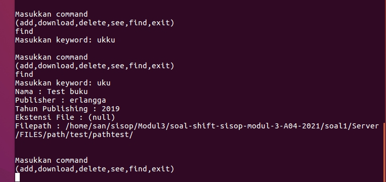

# Laporan Soal Shift Modul 3

### Kelompok A04
- Ihsannur Rahman Qalbi 05111940000090
- Muhamad Fikri Sunandar 05111940000135
- Reyhan Naufal Rahman 05111940000171

### Daftar isi
1. [NO 1](#NO1)
2. [NO 2](#NO2)
3. [NO 3](#NO3)

## NO1

### 1a dan 1b
#### Server.c
Membuat server yang dapat menerima multiple client yang hanya melayani satu client pada satu saat, dan membuat fungsi registrasi dan login untuk client.

```sh

int main(int argc, char const *argv[]) {
	FILE *fp = fopen("akun.txt","a");
	fclose(fp);
	fp = fopen("files.tsv","a");
	fclose(fp);
	fp = fopen("running.log","a");
	//fprintf
	fclose(fp);
	char path[256];
	memset(path,0,256);
	getcwd(path,256);
	sprintf(path,"%s/FILES",path);
	struct stat st = {0};
	if (stat(path, &st) == -1){
		mkdir(path,0777);
	}
.....
```
Saat server dijalankan, akan membuat beberapa file(akun.txt,files.tsv,running.log) yang diperlukan dan membuat direktori FILES.

```sh
int main(int argc, char const *argv[]) {
.....
	
	int opt = 1;
    int server_fd, valread;
    struct sockaddr_in address;
    int addrlen = sizeof(address);

      
    if ((server_fd = socket(AF_INET, SOCK_STREAM, 0)) == 0) {
        perror("socket failed");
        exit(EXIT_FAILURE);
    }
      
    if (setsockopt(server_fd, SOL_SOCKET, SO_REUSEADDR | SO_REUSEPORT, &opt, sizeof(opt))) {
        perror("setsockopt");
        exit(EXIT_FAILURE);
    }

    address.sin_family = AF_INET;
    address.sin_addr.s_addr = INADDR_ANY;
    address.sin_port = htons( PORT );
      
    if (bind(server_fd, (struct sockaddr *)&address, sizeof(address))<0) {
        perror("bind failed");
        exit(EXIT_FAILURE);
    }

    if (listen(server_fd, 5) < 0) {
        perror("listen");
        exit(EXIT_FAILURE);
    }
	pthread_t socket_thread[5][2];
  	int index_client;
	for(index_client=0;index_client<5;index_client++){
		client[index_client] = (user*)malloc(sizeof(user));
		if ((client[index_client]->sock = accept(server_fd, (struct sockaddr *)&address, (socklen_t*)&addrlen))<0) {
		    perror("accept");
		    exit(EXIT_FAILURE);
		}
		client[index_client]->logged = 0;
		pthread_create(&socket_thread[index_client][0],NULL,&server_scan_routine,(void*)&index_client);
		pthread_create(&socket_thread[index_client][1],NULL,&server_main_routine,(void*)&index_client);
		
	}
	for(index_client=0;index_client<5;index_client++){
		pthread_join(socket_thread[index_client][0], NULL);
		pthread_join(socket_thread[index_client][1], NULL);
	}
}
```
Dari sisi server menerima socket dari client (asumsi maksimal client yang diterima adalah 5) kemudian menjalankan 2 buah thread untuk masing masing socket setelah diterima , satu thread untuk menerima input dari client(server_scan_routine), dan yang lain untuk mengirim output ke client(server_main_routine).

Struktur dari variabel client adalah sebagai berikut
```sh
typedef struct user{
	char username[256], password[256],input[256];
	int sock,logged;
	
}user;

user *client[5];
int active_client= 0;
```
variabel client dan active_client memiliki scope global agar bisa di akses semua fungsi

```sh
char* getdata(char buffer[],int index) {

	memset(client[index]->input,0,256);
	while(strlen(client[index]->input)==0);
	strcpy(buffer,client[index]->input);
	memset(client[index]->input,0,256);
	return buffer;
}

void *server_scan_routine(void *arg){
	int i = *(int*) arg-1;
	char buffer[256];
	while (1){
			recv(client[i]->sock,buffer,256,0);
			strcpy(client[i]->input, buffer);
	}
}
```

```sh
void *server_main_routine(void *arg){
	int i = *(int*) arg-1;
	char buffer[256];
	char buffer_name[256];
	char path[256];
	while(1){
		memset(buffer,0,256);	
		if(i != active_client){
			send(client[i]->sock,"not active client",256,0);
			getdata(buffer,i);
			continue;
			
		}
	if(client[i]->logged == 0){
			sprintf(buffer,"pilih opsi :\n1. register\n2. login\n");
			send(client[i]->sock,buffer,256,0);
			getdata(buffer,i);
			if(strcmp(buffer,"1")==0){
				send(client[i]->sock,"New Username:",256,0);
				getdata(client[i]->username,i);
				send(client[i]->sock,"New Password:",256,0);
				getdata(client[i]->password,i);
				regis(client[i]);
			}
			else if(strcmp(buffer,"2")==0){
				send(client[i]->sock,"Username:",256,0);
				getdata(client[i]->username,i);
				send(client[i]->sock,"Password:",256,0);
				getdata(client[i]->password,i);
				login(client[i]);
				if (client[i]->logged == 1){
					send(client[i]->sock,"Login success\n",256,0);
				}
				else{
					send(client[i]->sock,"invalid username or password\n",256,0);
				}
			}
			else{
				send(client[i]->sock,"Invalid Command\n",256,0);
			}
		}
	if(client[i]->logged == 1){
			sprintf(buffer,"\nMasukkan command \n(add,download,delete,see,find,exit)\n");
			send(client[i]->sock,buffer,256,0);
			getdata(buffer,i);

....
	}
			else if(strcmp(buffer,"exit")==0){
				active_client++;
				if(active_client>5){
					active_client = 0;
				}
			}
			else{
				send(client[i]->sock,"Invalid Command\n",256,0);
			}
		}	
	}	
}

```
Dalam server_main_routine, jika thread adalah milik client yang bukan client aktif, server akan terus mengirim pesan "not active client" ke client.
Jika thread adalah milik client yang aktif, server akan memberikan opsi kepada client untuk melakukan register atau login.
Setelah client login, client dapat memasukan command exit untuk mengindikasikan bahwa client tersebut sudah selesai, dan posisi active_client akan dipindahkan ke client berikutnya.
```sh
void regis(user *client){
	FILE *fp = fopen("akun.txt","a");
	fprintf(fp,"%s.%s\n",client->username,client->password);
	fclose(fp);
}
```
Fungsi regis akan menulis pada file akun.txt.
```sh
void login(user *client){
	ssize_t read;
	FILE* fp = fopen("akun.txt","r");
	size_t len;
	char auth[256];
	sprintf(auth,"%s.%s\n",client->username,client->password);
	char *string;
	while((read = getline(&string,&len,fp))!= -1){
		if (strcmp(auth,string)==0){
			client->logged = 1;
			break;
		}
	}
	fclose(fp);
}
```
Fungsi Login akan membaca file akun.txt dan membandingkan username dan password yang dimasukkan client dengan text yang ada dalam file.

#### Client.c
```sh
int main(int argc, char const *argv[]) {


    struct sockaddr_in address;
    int valread;
    sock = 0;
    struct sockaddr_in serv_addr;
 
    char buffer[256] = {0};
    if ((sock = socket(AF_INET, SOCK_STREAM, 0)) < 0) {
        printf("\n Socket creation error \n");
        return -1;
    }
 
    memset(&serv_addr, '0', sizeof(serv_addr));
  
    serv_addr.sin_family = AF_INET;
    serv_addr.sin_port = htons(PORT);
      
    if(inet_pton(AF_INET, "127.0.0.1", &serv_addr.sin_addr)<=0) {
        printf("\nInvalid address/ Address not supported \n");
        return -1;
    }
  
    if (connect(sock, (struct sockaddr *)&serv_addr, sizeof(serv_addr)) < 0) {
        printf("\nConnection Failed \n");
        return -1;
    }
	
	pthread_create(&input, NULL,&routine_input, (void *)&sock);
	pthread_create(&output, NULL,&routine_output, (void *)&sock);
	while(1){
		if(pthread_join(input,NULL)==0){
			pthread_create(&input,NULL,&routine_input,(void *)&sock);
		}
	}
	
	//pthread_join(input,NULL);
	pthread_join(output,NULL);
    return 0;
}
```
```sh
void *routine_output(void *arg){
	int sock = *(int*)arg;
	char buffer[256] = {0};
	while(1){
		memset(buffer,0,256);
		if(recv(sock,buffer,256,0)>1){
		printing = 1;
		char buffer2[256];
		strcpy(buffer2,buffer);
		if(strcmp(buffer2,"_download_start_")==0){
			recv(sock,buffer,256,0);
			strcpy(buffer2,buffer);
			download(buffer2);
			pthread_cancel(input);
			printing = 0;
			continue;
		}
		pthread_cancel(input);
		printf("%s",buffer2);
		printing = 0;
		}
	}
}
```
```sh
void *routine_input(void *arg){
	int sock = *(int*)arg;
	char input[256];
	char buffer[256];
	while(1){
		if(printing == 0){
			memset(input,0,256);
			fgets(input,256,stdin);
			if(input[strlen(input)-1] == '\n'){
				int len = strlen(input);
		
				input[--len] = '\0';
			}
			send(sock,input,256,0);
		}
	}
}

```

Fungsi main pada client untuk menghubungkan socket ke server, client membuat dua thread, satu untuk mencetak hasil output dari server, dan satu untuk menginput data ke server.
Ketika client menerima output dari server, routine_output akan menghentikan thread input sehingga tidak blocking, dan thread input kembali dijalankan dengan looping di fungsi main.

#### Output


### 1c
#### Server.c
```sh
void *server_main_routine(void *arg){
....

....
	if(client[i]->logged == 1){
		sprintf(buffer,"\nMasukkan command \n(add,download,delete,see,find,exit)\n");
		send(client[i]->sock,buffer,256,0);
		getdata(buffer,i);
		for(int strindex=0;buffer[strindex];strindex++){
			buffer[strindex] = tolower(buffer[strindex]);
		}
		if(strcmp(buffer,"add")== 0){
			send(client[i]->sock,"Nama buku: ",256,0);
			getdata(buffer_name,i);		
			if(file_exist(buffer_name)){
				send(client[i]->sock,"Buku dengan nama ini sudah ada",256,0);
				continue;
			}
			tambah(buffer_name);
			writelog("Tambah",buffer_name,client[i]);
			tambah("\t");
			send(client[i]->sock,"Publisher: ",256,0);
			getdata(buffer,i);
			tambah(buffer);
			tambah("\t");
			send(client[i]->sock,"Tahun Publikasi: ",256,0);
			getdata(buffer,i);
			tambah(buffer);
			tambah("\t");
			send(client[i]->sock,"File Path: ",256,0);
			getdata(buffer,i);
			if(buffer[strlen(buffer)-2]=='/'){
				send(client[i]->sock,"foota ",256,0);
				int len =strlen(buffer);
				buffer[--len] = '\0';
			}
			getcwd(path,256);
			sprintf(path,"%s/FILES/%s/",path,buffer);
			rek_mkdir(path);
			tambah(path);
			sprintf(path,"%s/%s",path,buffer_name);
			
			tambahF(path);
			tambah("\n");
		}
....
```
Setelah client berhasil login, server mengirim list aksi yang dapat dilakukan client, jika client melakukan 'add' client akan diminta memasukan nama buku yang akan ditambahkan, jika buku dengan nama tersebut sudah ada, perintah 'add' berhenti berjalan, jika nama buku tersebut belum ada, client akan diminta memasukan data yang dibutuhkan sesuai soal.
Setiap server menerima data buku yang akan dimasukkan server akan memanggil fungsi untuk memasukkan data tersebut ke files.tsv melalui fungsi "tambah".
```sh
void tambah(char buff[]){
	FILE *fp = fopen("files.tsv","a");
	fprintf(fp,"%s",buff);
	fclose(fp);
}
```
Setelah data yang dibutuhkan lengkap, server akan membuat direktori sesuai path kemudian membuat file sesuai nama buku.
```sh
void tambahF(char path[]){
	FILE *fp = fopen(path,"a");
	fclose(fp);
}

void rek_mkdir(char path[]){
	char *tok = strrchr(path,'/');
	if(tok != NULL){
		*tok = 0;
		rek_mkdir(path);
		*tok = '/';
	}
	mkdir(path,0777);
}
```
#### Output


### 1d
#### Server.c
```sh
void *server_main_routine(void *arg){
....

....
else if(strcmp(buffer,"download")== 0){
				send(client[i]->sock,"Nama buku akan didownload: ",256,0);
				getdata(buffer,i);
				if(file_exist(buffer)){
					send(client[i]->sock,"_download_start_",256,0);
					download(buffer);
					send(client[i]->sock,"_download_done_",256,0);
				}
				else{
					send(client[i]->sock,"File tidak ada\n",256,0);
				}
....
```
Jika client memilih aksi download, client diminta memasukkan nama buku, jika buku tidak ada, command download akan berhenti, jika ada maka download akan dimulai.

```sh
void download(char nama[256]){		//done
	int i = active_client;
	FILE *fp = fopen("files.tsv","r");
	char buffer[256], tokbuffer[256];
	const char* token;
	char* chr;
	
	int len;

	while(fgets(buffer,256,fp)){
		
		strcpy(tokbuffer,buffer);
		token = strtok(tokbuffer,"\t");
		if(strcmp(token,nama)==0){
		
			fclose(fp);
			token = strtok(NULL,"\t");
			token = strtok(NULL,"\t");
			token = strtok(NULL,"\t");

			asprintf(&chr,"%s",token);

			if(chr[strlen(chr)-1]=='\n'){
				len =strlen(chr);
				chr[--len] = '\0';
			}
			if(chr[strlen(chr)-1]=='/'){
				len =strlen(chr);
				chr[--len] = '\0';
			}
			sprintf(tokbuffer,"%s/%s",chr,nama);
			send(client[i]->sock,nama,256,0);
			fp = fopen(tokbuffer,"r");
			while (fgets(buffer,256,fp)){
				send(client[i]->sock,buffer,256,0);
			}
			
			break;
		}
	}
}
```
Untuk mendownload file, server akan menggunakan path file yang ada di files.tsv, kemudian isi file dibaca dan dikirim ke client.

#### Client.c
```sh
void *routine_output(void *arg){
...
if(strcmp(buffer2,"_download_start_")==0){
			recv(sock,buffer,256,0);
			strcpy(buffer2,buffer);
			download(buffer2);
			pthread_cancel(input);
			printing = 0;
			continue;
		}
...

void download(char nama_file[256]){
	FILE *fp = fopen(nama_file,"w");
	fclose(fp);
	fp = fopen(nama_file,"a");
	char buffer[256];
	
	while(1){
		memset(buffer,0,256);
		recv(sock,buffer,256,0);
		if(strcmp(buffer,"_download_done_")==0){
			break;
		}
		fprintf(fp,"%s",buffer);
		
	}
	fclose(fp);
}
```
Saat client menerima sinyal untuk memulai download, client akan membuat file sesuai dengan nama file yang dimasukkan, kemudian client akan menulis data dalam file dari server ke file di client.

#### Output


### 1e
```sh
void *server_main_routine(void *arg){
....

....
if(client[i]->logged == 1){
			sprintf(buffer,"\nMasukkan command \n(add,download,delete,see,find,exit)\n");
			send(client[i]->sock,buffer,256,0);
			getdata(buffer,i);
....
else if(strcmp(buffer,"delete")== 0){
				send(client[i]->sock,"Nama buku akan didelete: ",256,0);
				getdata(buffer,i);
				if(file_exist(buffer)){
					delete(buffer);
					writelog("Hapus",buffer,client[i]);
				}
				else{
					send(client[i]->sock,"File tidak ada\n",256,0);
				}
			}
....
```
Jika nama file yang ingin dihapus ada, maka fungsi delete akan di jalankan

```sh
void delete(char nama[256]){
	FILE* fp_lama=fopen("files.tsv","r");
	FILE* fp_baru = fopen("baru.tsv","w");
	fclose(fp_baru);
	fp_baru = fopen("baru.tsv","a");
	char* token;
	char buffer[256],tokbuffer[256],chr[256],chr2[256];
	int len;
	while(fgets(buffer,256,fp_lama)){
		strcpy(tokbuffer,buffer);
		token = strtok(tokbuffer,"\t");
		if(strcmp(nama,token)==0){
			token = strtok(NULL,"\t");
			token = strtok(NULL,"\t");
			token = strtok(NULL,"\t");
			sprintf(chr,"%s",token);

			if(chr[strlen(chr)-1]=='\n'){
				len =strlen(chr);
				chr[--len] = '\0';
			}
			if(chr[strlen(chr)-1]=='/'){
				len =strlen(chr);
				chr[--len] = '\0';
			}
			sprintf(tokbuffer,"%s/%s",chr,nama);
			sprintf(chr2,"%s/old-%s",chr,nama);
			rename(tokbuffer,chr2);
			continue;
		}
		fprintf(fp_baru,"%s",buffer);
	}
	remove("files.tsv");
	rename("baru.tsv","files.tsv");
	fclose(fp_lama);
	fclose(fp_baru);
}

```
Untuk mendelete suatu file, pertama semua line dalam files.tsv kecuali line yang berisi data file yang akan dihapus di duplikat ke baru.tsv.
Nama file yang 'dihapus' akan diubah menjadi old-Nama file.

#### Output


### 1f
```sh
void *server_main_routine(void *arg){
....

....
if(client[i]->logged == 1){
			sprintf(buffer,"\nMasukkan command \n(add,download,delete,see,find,exit)\n");
			send(client[i]->sock,buffer,256,0);
			getdata(buffer,i);
....
else if(strcmp(buffer,"see")== 0){
				see();
			}
....

void see(){
	int i = active_client;
	FILE *fp = fopen("files.tsv","r");
	char buffer[256];
	char line[256];
	char* token;
	char* ext;
	char* token_ext;
	while(fgets(line,256,fp)){	
		ext = strdup(line);
		token_ext=strtok(ext,".");
		token_ext=strtok(NULL,"\t");
		
		token = strtok(line,"\t");
		sprintf(buffer,"Nama : %s \n",token);
		send(client[i]->sock,buffer,256,0);
		token = strtok(NULL,"\t");
		sprintf(buffer,"Publisher : %s \n",token);
		send(client[i]->sock,buffer,256,0);
		token = strtok(NULL,"\t");
		sprintf(buffer,"Tahun Publishing : %s \n",token);
		send(client[i]->sock,buffer,256,0);
		sprintf(buffer,"Ekstensi File : %s \n",token_ext);
		send(client[i]->sock,buffer,256,0);
		token = strtok(NULL,"\t");
		sprintf(buffer,"Filepath : %s \n",token);
		send(client[i]->sock,buffer,256,0);

	}
	fclose(fp);
}
```
Fungsi see akan membaca seluruh line pada files.tsv dan mengirimkan nya ke client dengan format sesuai soal.

#### Output


### 1g
```sh
void *server_main_routine(void *arg){
....

....
if(client[i]->logged == 1){
		sprintf(buffer,"\nMasukkan command \n(add,download,delete,see,find,exit)\n");
		send(client[i]->sock,buffer,256,0);
		getdata(buffer,i);
....
		else if(strcmp(buffer,"find")==0){
			send(client[i]->sock,"Masukkan keyword: ",256,0);
			getdata(buffer,i);
			find(buffer);
		}

```
Saat client menjalankan fungsi find, server akan meminta keyword yang akan digunakan untuk mencari file.
```sh
void find(char keyword[256]){
	int i = active_client;
	FILE *fp = fopen("files.tsv","r");
	char buffer[256];
	char line[256];
	char* token;
	char* ext;
	char* token_ext;
	int cursor = 0;
	regex_t regex;
	while(fgets(line,256,fp)){	
		regcomp(&regex,keyword,0);
		
		ext = strdup(line);
		token_ext=strtok(ext,".");
		token_ext=strtok(NULL,"\t");
		
		token = strtok(line,"\t");
		if(regexec(&regex,token,0,NULL,0)!= 0){
			continue;
		}
		sprintf(buffer,"Nama : %s \n",token);
		send(client[i]->sock,buffer,256,0);
		token = strtok(NULL,"\t");
		sprintf(buffer,"Publisher : %s \n",token);
		send(client[i]->sock,buffer,256,0);
		token = strtok(NULL,"\t");
		sprintf(buffer,"Tahun Publishing : %s \n",token);
		send(client[i]->sock,buffer,256,0);
		sprintf(buffer,"Ekstensi File : %s \n",token_ext);
		send(client[i]->sock,buffer,256,0);
		token = strtok(NULL,"\t");
		sprintf(buffer,"Filepath : %s \n",token);
		send(client[i]->sock,buffer,256,0);

	}
	fclose(fp);
}
```
Fungsi find menggunakan regex untuk keyword. Jika saat membaca line dari files.tsv keyword ditemukan dalam nama file, data data dari buku akan di kirim ke client sesuai format soal, jika tidak, akan lanjutkan ke line berikutnya(jika ada).

#### Output


### 1h
```sh
void writelog(char cmd[], char nama_file[], user *client){
	FILE *fp = fopen("running.log","a");
	fprintf(fp,"%s : %s (%s:%s)\n",cmd,nama_file,client->username,client->password);
	fclose(fp);
}
```
Fungsi writelog untuk mencetak log ke running.log, fungsi writelog dipanggil setiap command add atau delete berhasil dijalankan.

#### Output


### Kendala yang ditemukan


Pada text yang dikirim client terdapat \n yang tidak perlu


Char yang mengandung file path terpotong saat digabungkan dengan fungsi sprintf

### Referensi
- https://stackoverflow.com/questions/3643427/how-to-find-a-line-in-a-file-using-regex-in-c
- https://www.geeksforgeeks.org/regular-expressions-in-c/
- https://stackoverflow.com/questions/12911299/read-csv-file-in-c
- https://www.tutorialspoint.com/c_standard_library/c_function_rename.htm
- https://man7.org/linux/man-pages/man2/listen.2.html
- https://stackoverflow.com/questions/3501338/c-read-file-line-by-line
- https://stackoverflow.com/questions/7430248/creating-a-new-directory-in-c

## NO2

### 2a
Membuat program perkalian matrix (4X3 dengan 3X6) dan menampilkan hasilnya. 
Kami membuatnya dengan konsep thread, maka kami membuat 3 variabel global.

```sh
pthread_t tid[4];
int mat_emt[4][3], mat_ten[3][6];
int (*hsl)[6];
```

Pertama tid[4] untuk menyimpan thread index dengan ukuran sesuai kebutuhan. Lalu mat_emt dan mat_ten adalah matriks untuk menyimpan nilai matriks. Dan yang terakhir (* hsl)[6] untuk menyimpan matriks hasil yang akan digunakan sebagai shared memory.

```sh
void *pengali_mat(void *arg){
    pthread_t id = pthread_self();

    for(int i=0; i<4; i++) {
        if(pthread_equal(id, tid[i])){
            for(int j=0; j<6; j++) {
                hsl[i][j] = (mat_emt[i][0] * mat_ten[0][j]) + (mat_emt[i][1] * mat_ten[1][j]) + (mat_emt[i][2] * mat_ten[2][j]);
            }
        }
    }

}
```

Membuat fungsi pengali_mat() untuk mengalikan matriks 4X3 dengan matriks 3X6. Di fungsi ini juga dibuat dengan konsep thread sehingga perkalian matriks dilakukan secara bersamaan tiap barisnya. 

```sh
key_t key = 1234;
int shmid = shmget(key,sizeof(int[4][6]),0666|IPC_CREAT); 
hsl = shmat(shmid,NULL,0);  
```

Lalu persiapan untuk membuat shared memory yang akan digunakan untuk proses selanjutnya.

```sh
  int i=0, err;

    while(i<4)
    {
        err = pthread_create(&(tid[i]), NULL, &pengali_mat, NULL); //pembuatan thread
        if(err != 0){
            printf("Can't create thread : [%s]\n", strerror(err));
        }else{
            //printf("Crate thread success\n");
        }
        i++;
    }
```

Membuat while loop sebanyak thread yang akan dibuat, di dalamnya diisi fungsi pthread_create() yang berisi variabel untuk menyimpan thread, dan fungsi yang dipanggil oleh thread. Gunakan kondisi jika thread gagal didibuat.

```sh
    for (int j=0; j<i; j++) {
        pthread_join(tid[j], NULL);
    }
```

Membuat forloop sebanyak thread yang dibuat untuk melakukan join thread dengan proses utama.

```sh
    printf("\nHasil perkalian:\n");
    for(int i=0; i<4; i++){
        for(int k=0; k<6; k++)
        {
            printf("%d ", hsl[i][k]);
        }
        printf("\n");
    }
```

Menampilkan hasil perkalian kedua matriks.

## Output:


### 2b
Menerima hasil matriks dari soal2a lalu dibandingkan dengan matriks baru dengan beberapa aturan untuk menghitung angka faktorial. Dan perhitungan tersebut dilakukan dengan konsep thread. 

```sh
pthread_t tid[24];
int (*hsl)[6];
long long int mat_hasil[4][6];
int mat_b[4][6];
```

Pertama tid[24] untuk menyimpan thread index dengan ukuran sesuai kebutuhan. Lalu mat_hasil dan mat_b adalah matriks untuk menyimpan nilai matriks yang nanti dihasilkan dan menyimpan nilai matriks b. Dan yang terakhir (* hsl)[6] untuk menyimpan matriks hasil yang akan digunakan sebagai shared memory.

```sh
long long int faktorial(int a, int b){
    long long int hasil=1;
    //if(a==0 || b==0){
     //   hasil = 0;
   // }else{
   for(int i=a; i>b; i--) {
   	hasil = hasil * i;
   }
    //}
    return hasil;
}
```

Membuat fungsi faktorial dengan parameter int a dan int b. Parameter ini digunakan untuk menghitung nilai faktorial int a dengan pembatas int b. Serta mengembalikan hasilnya. 

```sh
void *ops_faktorial(void *arg){
    pthread_t id = pthread_self();
    int l = 0;
    for(int i=0; i<4; i++) {
        for (int j=0; j<6; j++) {
            if(pthread_equal(id, tid[l])){
                if(hsl[i][j]>=mat_b[i][j]) {
                    mat_hasil[i][j] = faktorial(hsl[i][j], (hsl[i][j] - mat_b[i][j]));
                }
                if(mat_b[i][j]>hsl[i][j]){
                    mat_hasil[i][j] = faktorial(hsl[i][j], 1);
                }
                if(mat_b[i][j] == 0 || hsl[i][j]==0){
                    //mat_hasil[i][j] = faktorial(hsl[i][j], mat_b[i][j]);
                    mat_hasil[i][j] = 0;
                }
            }
            l++;
        }
    }
}
```

Membuat fungsi ops_faktorial() yakni fungsi yang mengeksekusi matriks sesuai dengan dengan deskripsi soal dengan konsep thread. Lalu menyimpan hasil matriksnya ke variabel mat_hasil. 

```sh
    key_t key = 1234;
    int shmid = shmget(key,sizeof(int[4][6]),0666|IPC_CREAT); 
    hsl = shmat(shmid,NULL,0);  
```

Lalu persiapan untuk membuat shared memory yang akan digunakan menerima data dari proses sebelumnya.

```sh
    printf("Hasil soal2a:\n");
    for(int i=0; i<4; i++){
        for(int k=0; k<6; k++)
        {   
            printf("%d ", hsl[i][k]);
        }
        printf("\n");
    }
```

Menampilkan matriks dari proses sebelumnya.

```sh
    int l=0, err;
    while(l<24){
        err = pthread_create(&(tid[l]), NULL, &ops_faktorial, NULL); //pembuatan thread
        if(err != 0){
            printf("Can't create thread : [%s]\n", strerror(err));
        }else{
            // printf("Crate thread success\n");
        }
        l++;
    }
```

Membuat while loop sebanyak thread yang akan dibuat, di dalamnya diisi fungsi pthread_create() yang berisi variabel untuk menyimpan id thread, dan fungsi yang dipanggil oleh thread yakni ops_faktorial(). Gunakan kondisi jika thread gagal didibuat.

```sh
    for (int j=0; j<l; j++) {
        pthread_join(tid[j], NULL);
    }
```
Membuat forloop sebanyak thread yang dibuat untuk melakukan join thread dengan proses utama.

```sh
    printf("\nMatrik hasil\n");
    for(int i=0; i<4; i++) {
        for(int j=0; j<6; j++) {
            printf("%llu ", mat_hasil[i][j]);
        }
        printf("\n");
    }
```

Menampilkan hasil matirks yang diperoleh.

## Output:


### 2c
Melaksanakan command “ps aux | sort -nrk 3,3 | head -5” dengan IPC Pipes. 

```sh
	int fd1[2], fd2[2];
 
	pid_t p, m; 

	if (pipe(fd1)==-1) 
	{ 
		fprintf(stderr, "Pipe Failed" ); 
		return 1; 
	} 

    if (pipe(fd2)==-1) 
	{ 
		fprintf(stderr, "Pipe Failed" ); 
		return 1; 
	} 
```
Membuat variabel matriks fd1 dan fd2 untuk menyimpan keperluan pembuatan pipe. Melakukan pengecekan apakah pipe berhasil dibuat dengan konsep if (kondisi). 

```sh
	p = fork(); 

	if (p < 0) 
	{ 
		fprintf(stderr, "fork Failed" ); 
		return 1; 
	} 
```
Membuat fork dan mengecek apakah fork berhasil dibuat atau tidak. 

```sh
	// Parent process 
	else if (p > 0) 
	{ 

        dup2(fd1[1], 1);

		close(fd1[0]); 
		close(fd1[1]); 
        close(fd2[0]); 
		close(fd2[1]); 

        char *argv1[] = {"ps", "aux", NULL};
        execv("/bin/ps", argv1);

	} 
```
Di dalam parent process dari fork tadi, Melakukan eksekusi "ps aux" dengan fungsi execv. Serta melaukan pengiriman data dengan fd1 dengan fungsi dup2 ke process child.

```sh
	// child process 
	else
	{
        wait(NULL);
        m = fork(); 

        if (m < 0) 
        { 
            fprintf(stderr, "fork Failed" ); 
            return 1; 
        } 
```
Di child process, melakuakn wait data yang dikirim oleh parent process serta membuat fork baru dan mengecek apakah fork berhasil dibuat atau tidak. 

```sh
	else if(m > 0) 
        {
            dup2(fd1[0], 0);
            close(fd1[1]); 
            close(fd1[0]); 

            dup2(fd2[1], 1);
            close(fd2[0]); 
            close(fd2[1]);
            char *argv1[] = {"sort", "-nrk", "3,3", NULL};
            execv("/bin/sort", argv1);


        }
```
Di dalam anak process baru yang dibuat tadi, melakukan penerimaan data dengan variabel fd1. Serta melakukan eksekusi command "sort", "-nrk", "3,3" dengan fungsi execv. Serta melakukan pengiriman data dengan variabel fd2 dengan fungsi dup2. 

```sh
	else
        {
            wait(NULL);
            dup2(fd2[0], 0);

            close(fd1[1]); 
            close(fd1[0]);
            close(fd2[0]); 
		    close(fd2[1]); 

            char *argv1[] = {"head", "-5", NULL};
            execv("/bin/head", argv1);
            exit(0);
        }
```
Di parent process yang baru dibuat, melakukan wait data dari porcess sebelumnya. Serta menerima data dari process sebelumnya dengan fungsi dup2 dan variabel fd2. Serta melakukan perintah command "head", "-5".

## Output:


### Kendala:
- Error 1: Tidak bisa melakukan passing parameter ke fungsi melalui thread. Solusinya menggunakan global variabel.

- Error 2: Tidak bisa menjalankan pipe sebagaimana mestinya. Solusinya menggunakan nested fork.


## NO3

Seorang mahasiswa bernama Alex sedang mengalami masa gabut. Di saat masa gabutnya, ia memikirkan untuk merapikan sejumlah file yang ada di laptopnya. Karena jumlah filenya terlalu banyak, Alex meminta saran ke Ayub. Ayub menyarankan untuk membuat sebuah program C agar file-file dapat dikategorikan. Program ini akan memindahkan file sesuai ekstensinya ke dalam folder sesuai ekstensinya yang folder hasilnya terdapat di working directory ketika program kategori tersebut dijalankan.

### `Opsi -f`
Program menerima opsi -f seperti contoh di atas, jadi pengguna bisa menambahkan argumen file yang bisa dikategorikan sebanyak yang diinginkan oleh pengguna. 

Output yang dikeluarkan adalah seperti ini :
```
File 1 : Berhasil Dikategorikan (jika berhasil)
File 2 : Sad, gagal :( (jika gagal)
File 3 : Berhasil Dikategorikan
```


### `Opsi -d`
Program juga dapat menerima opsi -d untuk melakukan pengkategorian pada suatu directory. Namun pada opsi -d ini, user hanya bisa memasukkan input 1 directory saja, tidak seperti file yang bebas menginput file sebanyak mungkin. Contohnya adalah seperti ini:
```bash
$ ./soal3 -d /path/to/directory/
```


### ` Opsi \* `
Selain menerima opsi-opsi di atas, program ini menerima opsi `\*`, contohnya ada di bawah ini:
```bash
$ ./soal3 \*
```


### Pembahasan
Pembahasan fungsi dan logika dari soal 3.

`main`
```c
    if (strcmp(argv[1], "-f") == 0)
    {
        pthread_t tf[argc - 2];
        for (int i = 2; i < argc; i++)
        {
            if (pthread_create(&tf[i - 2], NULL, &process, (void *)argv[i]) == 1)
            {
                printf("File %d: Sad, gagal:(\n", i - 1);
            }

            printf("File %d: Berhasil Dikategorikan\n", i - 1);
        }
    }
```
* Memproses input file dengan argumen `-f`, lalu membuat thread sebanyak file yang dinputkan oleh user. Jika return dari fungsi create itu 1, maka thread yang dijankan rusak dan akan mengeluarkan output `File %d: Sad, gagal:(\n` apabila input berhasil dieksekusi `"File %d: Berhasil Dikategorikan\n`. Program dibuatkan thread nya dan akan menjalankan fungsi process dan akan mempasing argumen `(void *)argv[i]`

```c
else if (strcmp(argv[1], "*") == 0)
    {

        char buff[1337];
        getcwd(buff, sizeof(buff));
        directory = buff;
    }
```
* Memproses input `\*` dan akan mengambil string dari current directory dan akan menyimpannya di variabel directory

```c
else if (strcmp(argv[1], "-d") == 0)
    {
        DIR *dir = opendir(argv[2]);
        if (dir)
        {
            directory = argv[2];
        }
        closedir(dir);
    }
```
* Memproses input -d dan akan mengambil directory yang diinput user dari parameter program dan akan menyimpannya di variabel directory.


`Fungsi getName()`
``` c
char *getName(char *name, char buff[])
{

    char *token = strtok(name, delim);
    while (token != NULL)
    {
        sprintf(buff, "%s", token);
        token = strtok(NULL, delim);
    }
}
```
Fungsi mendefinisikan dua paramater yaitu `name` dan pointernya yaitu `buff[]`
untuk store hasil dari fungsi tersebut.

token akan memecah string dengan delimeter `/` lalu while loop aka berjalan
hingga selesai dan dimasukan ke dalam buffer.


`Fungsi getExt()`
```c

char *getExt(char *name, char buff[])
{
    char *token = strtok(name, delim);
    while (token != NULL)
    {
        sprintf(buffName, "%s", token);
        token = strtok(NULL, delim);
    }
    int count = 0;
    token = strtok(buffName, delimA);

    while (token != NULL)
    {
        count++;
        sprintf(buff, "%s", token);
        token = strtok(NULL, delimA);
    }

    return buff;
}
```
Fungsi mendefinisikan dua paramater yaitu `name` dan pointernya yaitu `buff[]`
untuk store hasil dari fungsi tersebut dan akan mereturn ekstensi dari sebuah file.

`Fungsi checkDirectory()`
```c
void checkDirectory(char name[])
{
    DIR *dr = opendir(name);
    umask(0);
    if (ENOENT == errno)
    {
        mkdir(name, 0775);
        closedir(dr);
    }
}
```
Fungsi akan membiat directory baru jika menggunakan fungsi `mkdir()`
dengan nama yang di passing dan dengan permission `0775` yang artinya
read dan execute lalu akan menutup kembali.

`Fungsi process()`
```c
getcwd(cwd, sizeof(cwd));
    //ngedapatin nama file nya

    strcpy(buffFrom, (char *)arg);

    if (access(buffFrom, F_OK) == -1)
    {
        // printf("File %s tidak ada\n", buffFrom);
        pthread_exit(0);
    }
    DIR *dir = opendir(buffFrom); //open directory
    //ngecek kl dia folder dan langsung kleuar. Kl argumen -F tapi malah folder jadi gini

    if (dir)
    {
        // printf("file %d: Sad, gagal\n", i);
        pthread_exit(0);
    }
    closedir(dir);

    getName(buffFrom, buffName); //misahin .extension nya
    strcpy(buffFrom, (char *)arg);

    getExt(buffFrom, buffExt); //dapetin extension
    for (int i = 0; i < sizeof(buffExt); i++)
    {
        buffExt[i] = tolower(buffExt[i]);
    }

    strcpy(buffFrom, (char *)arg);

    checkDirectory(buffExt);
    // printf("File %d: Berhasil Dikategorikan\n", i);

    sprintf(buffTo, "%s/%s/%s", cwd, buffExt, buffName);
    rename(buffFrom, buffTo);

    pthread_exit(0);
```
* Pertama-tama menggunakan fungsi cwd dari linux akan mengembalikan string yang akan
di sotre pada variabel cwd.
* Lalu akan meng-copy dari parameter yang dipassing ke variabel buffFrom
* Cek bentuk file yang diinputkan dengan menggunakan `dir`, dimana jika terbuka sebagai directory akan menampilkan error dan thread akan selesai `pthread_exit(0)`
* menutup directory
* mengambil nama file dan mendapatkan extensinya
* lalu mengkonversikan ke huruf kecil dengan fungsi `toLower`
* lalu akan merename ` sprintf(buffTo, "%s/%s/%s", cwd, buffExt, buffName)` dengan fungsi rename `rename(buffFrom, buffTo)`


